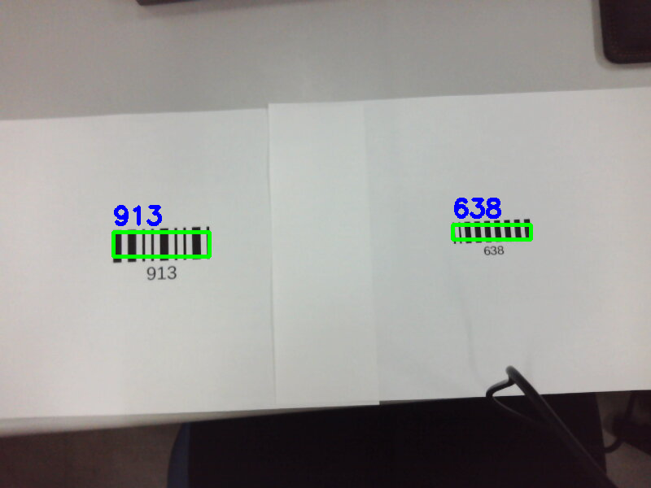

# Barcode-Recognition
Barcode Recognition (Pharmacode)

This program can read the pharmacode. It can perform robust and fast detection even when multiple pharmacodes are in the picture.

## Environment
- CMake 3.10
- Ubuntu 20.04 LTS  
- OpenCV 4.5.2
- TBB


## Build & Run

### Clone & Build 

```bash
git clone https://github.com/shun74/Barcode-Recognition.git
cd Barcode-Recognition
sh build.sh
```

### Run

Scan one image.

```bash
./build/scan_multiple ./config/sample_config.conf ./images/test_1.jpg
```

Realtime scan with camera. (Necessary to connect camera before run)

```bash
./build/real_time ./config/fast_run_config.conf
```

## Working Sample

Test 1


Test 2


Multiple scan sample


## Config

To make this program more flexible, some configs exists. 

For specific values, see [config](/config/).

### Image process
- IMAGE_PROCESS : Conduct image preprocess or not. (Slightly unstable)
- GAMMA : Gamma correlation parameter.
- BLUR_KERNEL : Unsharp masking parameter.
- UNSHARP_K : Unsharp masking parameter.

### Barcode scan
- NUM_MAX_BARCODE : Max number of barcodes to scan.
- BARCODE_LENGTH : Number of black lines in barcode.
- SKIP_LENGTH : Number of line to skip in source image.
- FILL_WINDOW_SIZE : Window size to fill scan result.
- MIN_BARCODE_SIZE : Min barcode size to recognize.

### Utils
- OUTPUT : Output images save dir.
- VISUALIZE : Show result image window or not.


## What is the Pharmacode ?

> Pharmacode, also known as Pharmaceutical Binary Code, is a barcode standard, used in the pharmaceutical industry as a packing control system. [Wikipedia](https://en.wikipedia.org/wiki/Pharmacode)

### Components of Pharmacode

Decoding a pharmacode is very simple.

Pharmacode is a binary code, so that this has only two type of black bar (wide & narrow).


Each bar has position like above image. If position *i* is narrow just add $2^i$. If it's wide then add $2^{(i+1)}$.

For example : *position 5 is wide bar* -> add $2^6=64$.

This means that to read these code from the image by program, we only need to obtain something like a frequency component of binarized image.

For more detail.
[About Laetus/Pharmacodes - Computalabel](https://www.computalabel.com/aboutpharmacodes.htm)

### Sample

Some samples in [barcodes](/barcodes/).

$ 755 = 2^0 + 2^1 + 2^3 + 2^3 + 2^5 + 2^6 + 2^7 + 2^8 + 2^8$


[Online pharmacode generator](https://products.aspose.app/barcode/ja/generate/pharmacode)